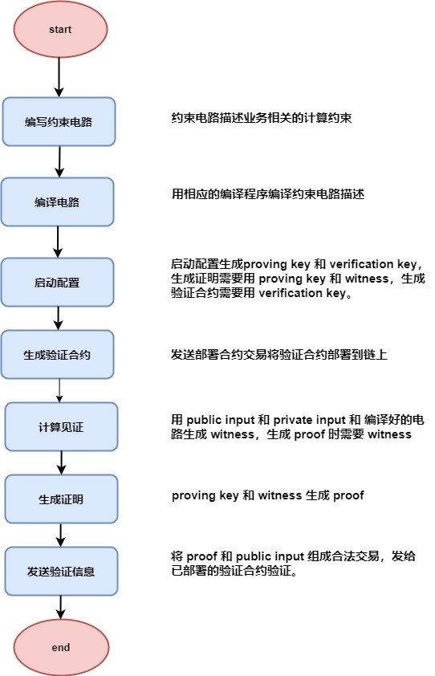
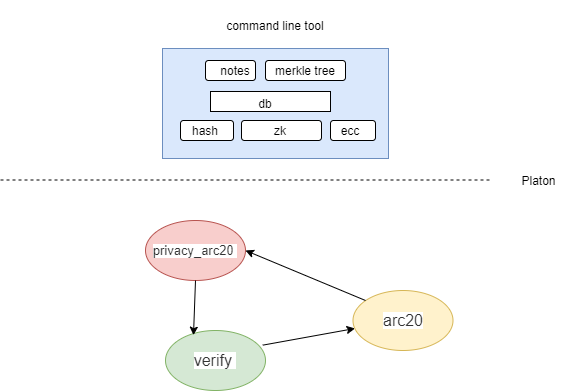
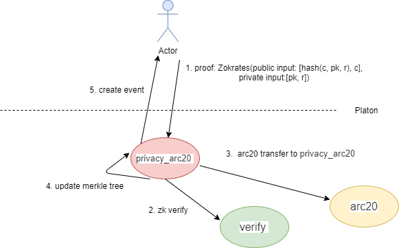
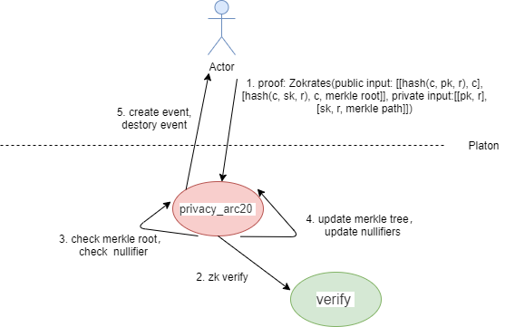
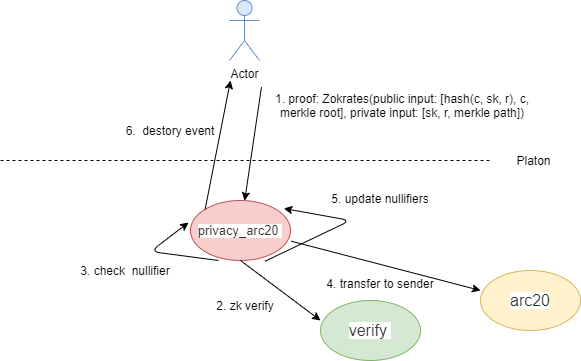

# 隐私 demo 设计

## 零知识框架

PlatON 提供了通用零知识证明 zk-SNARKs 框架，此框架核心动作是生成证明和校验证明。

**private input**: 不对外披露的，只有 prover 自己知道这个值。

**public input**：prover 与 Verifier 之间共享的一个值。

证明者（prover）在不暴露有用信息 **private input** 的情况下使验证者（verifier) 验证 proof 通过。

用户可以根据具体的业务场景，利用 PlatON 的零知识框架生成验证合约，不同的值设置不同的 witness，生成相应的 proof， 发到验证合约验证 proof。

## 密码学组件

hash 算法支持： mimc， poseidon，rescue zk友好的 hash 算法。

zk算法： groth16， gm17 ，pghr13。

曲线支持： bn256，bls12_381。

## demo 功能设计

### demo 概述

利用隐私框架生成链上验证合约，功能上支持 Arc20 token 地址隐藏，金额公开。

钱包客户端通过事件维护notes，主要是 note 产生和销毁，实现余额查询，隐私 token的转账等操作。

便于客户端收集note，note 所属的 owner 信息为 pk 和 r 用 pk 加密。

privacy_arc20 合约维护 MerkleTree 和 nullifiers。

verify 合约进行 zk 的 验证。

arc20 合约维护 arc20 token 的转账，余额。

产品形态为命令行工具，查询余额，发起 mint，transfer， burn 操作。

### 名词释义

pk：公钥，标识地址，对应的私钥为 sk。

r： 随机数，和一个 note 是一一对应的，生成算法保证不能重复。

owner: pk 加密 （pk，r）二元组的结果，客户端用 sk 解密，解密成功说明此 note 为自己的。

commitment： （c，pk，r）三元组的 hash 值。

nullifier： （c，sk，r）三元组的 hash 值。

proof： Zokrates 工具，每次输入相应 private input 和 public input，加上对应验证合约的 proving key 一起生成。

### mint

private input 为 pk， r。

public input 为 金额 c，（c，pk，r）三元组的 hash 值

1. 命令行侧生成 public input（c，pk，r）三元组生成的hash值即新的 commitment。pk 加密 （pk，r）二元组。

   通过 private input 生成 proof。

2. verify 验证 public input 值 commitment 和 c

3. arc20 合约将金额 c 转入到 privacy_arc20 合约

4. privacy_arc20 合约将 commitment 存入并刷新 MerkleTree 的 root。

5. 发送 create 事件，create(std::uint256_t amount, h256 coin, uint32_t coin_index, bytes owner);

### transfer

生成输出 note 侧：

private input 为 pk， r。

public input 为 金额 c，（c，pk，r）三元组的 hash 值

消耗输入 note 侧：

private input 为 sk， r， merkle path。

public input 为 金额 c，（c，sk，r）三元组的 hash 值， merkle root。

1. 命令行侧生成 public input（c，pk，r）三元组生成的hash值即新的 commitment。pk 加密 （pk，r）二元组。

   命令行侧生成（c，sk，r）三元组的 hash 值即nullifier。

   根据命令行维护的 MerkleTree，通过 private input 生成 proof。

2. verify 验证 public input。

3. privacy_arc20 验证 merkle root 有效，验证 nullifier 不在 nullifiers 里面避免双花。

4. privacy_arc20 合约将 commitment 存入并刷新 MerkleTree 的 root 和 nullifiers。

5. 发送 create 事件，create(std::uint256_t amount, h256 coin, uint32_t coin_index, bytes owner);

   发送 destory 事件， destory(h256 nullifier）

### burn

private input 为 sk， r， merkle path。

public input 为 金额 c，（c，sk，r）三元组的 hash 值， merkle root。

1. 命令行侧生成（c，sk，r）三元组的 hash 值即nullifier。

   根据命令行维护的 MerkleTree，通过 private input 的值 sk， r， merkle path生成 proof。

2. verify 验证 public input。

3. privacy_arc20 验证 nullifier 不在 nullifiers 里面避免双花。

4. arc20 合约将金额 c ，转出到发起交易账户。

5. 刷新 nullifiers。

6. 发送 destory 事件， destory(h256 nullifier）

### 功能总结

整个合约交易信息里面不会暴露转账目地址，进而实现了隐私。

利用底层链的 bn256 或 bls12_381 曲线上的 zk 验证接口和 PlatONnetwork/Zokrates 零知识工具集，描述约束，生成验证合约，实现链上验证。

private input 和 public input 之间的约束需要用 Zokrates 的 电路描述语言描述，并生成 wasm 验证合约。

将生成随机数，公私钥对，零知识算法生成 proof 等密码组件集成到命令行。

命令行维护 MerkleTree，加密 owner，维护 notes，展示余额。